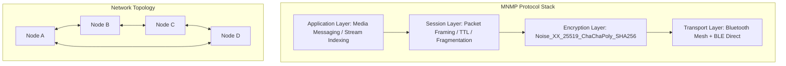
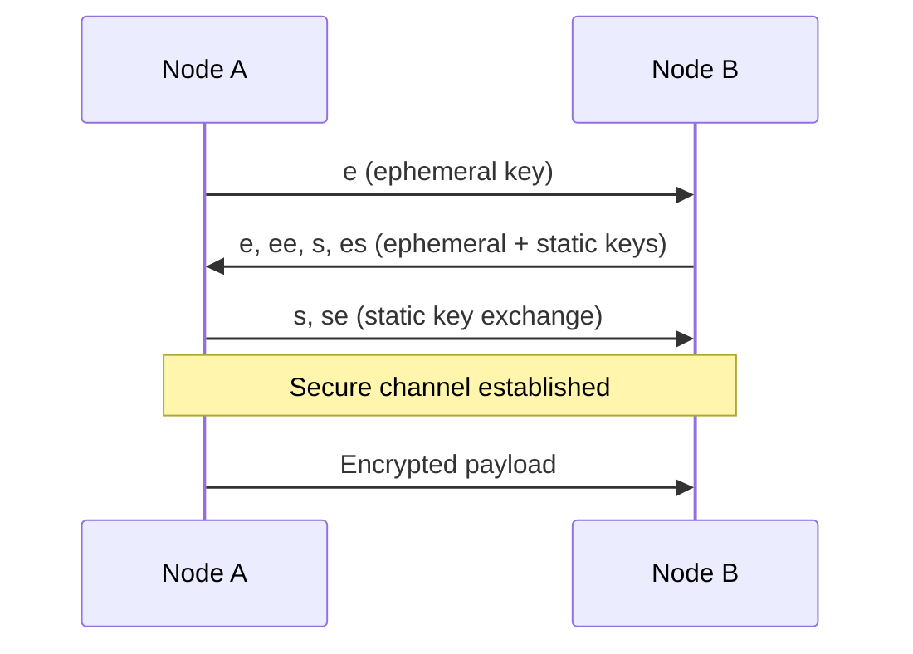
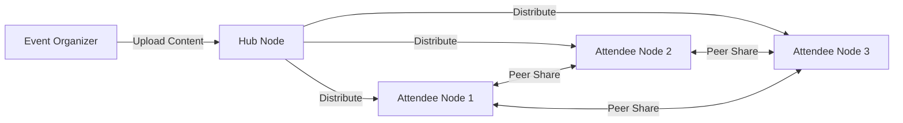

# MeshTV Noise Mesh Protocol v1 (MNMP)
## Decentralized Video Streaming Protocol Whitepaper

**Version:** 1.0  
**License:** MIT (Open Source)  
**Authors:** Mesh TV Network Development Team  
**Date:** January 2025

---

## Abstract

The MeshTV Noise Mesh Protocol v1 (MNMP) is a decentralized video streaming protocol built on the Noise Protocol Framework with Bluetooth Low Energy (BLE) mesh transport. MNMP enables peer-to-peer video distribution without centralized infrastructure, providing end-to-end encryption, forward secrecy, and traffic analysis resistance for offline-first streaming networks.

## Table of Contents

1. [Introduction](#introduction)
2. [Architecture Overview](#architecture-overview)
3. [Protocol Layers](#protocol-layers)
4. [Security Model](#security-model)
5. [Packet Specification](#packet-specification)
6. [Implementation Guide](#implementation-guide)
7. [Usage Examples](#usage-examples)
8. [Performance Analysis](#performance-analysis)
9. [Future Roadmap](#future-roadmap)
10. [References](#references)

---

## 1. Introduction

Traditional video streaming relies on centralized Content Delivery Networks (CDNs) that create single points of failure and require constant internet connectivity. MNMP addresses these limitations by creating a self-healing mesh network where devices can share video content directly with nearby peers.

### 1.1 Problem Statement

- **Connectivity Dependence**: Traditional streaming requires stable internet
- **Bandwidth Costs**: High data costs for content providers and consumers
- **Censorship Vulnerability**: Centralized systems can be blocked or monitored
- **Infrastructure Requirements**: Remote areas lack proper CDN coverage

### 1.2 Solution Overview

MNMP creates a decentralized streaming ecosystem where:
- Devices form autonomous mesh networks using BLE
- Content is fragmented and distributed across multiple nodes
- Encryption ensures privacy and authenticity
- No central servers required for operation

---

## 2. Architecture Overview



### 2.1 Design Principles

1. **Decentralization**: No single point of failure
2. **Privacy**: End-to-end encryption by default
3. **Resilience**: Self-healing network topology
4. **Efficiency**: Optimized for mobile device constraints
5. **Extensibility**: Modular layer architecture

---

## 3. Protocol Layers

### 3.1 Transport Layer: BLE Mesh + Broadcast

The transport layer handles device discovery and packet transmission using Bluetooth Low Energy mesh networking.

#### Features:
- **BLE GATT Bearer**: Standard Bluetooth mesh protocol
- **Direct BLE Broadcast**: High-bandwidth peer-to-peer transfer
- **Bloom Filter Caching**: Prevents packet reprocessing
- **Smart Hop Routing**: Signal strength and peer density weighting

#### Implementation:
```typescript
class TransportLayer {
  async sendPacket(packet: MNMPPacket, targetNodeId?: string): Promise<boolean>
  async startScanning(): Promise<void>
  async startAdvertising(nodeInfo: Partial<MeshNode>): Promise<void>
  getDiscoveredNodes(): MeshNode[]
}
```

### 3.2 Encryption Layer: Noise_XX_25519_ChaChaPoly_SHA256

The encryption layer provides end-to-end security using the Noise Protocol Framework.

#### Noise Pattern: XX
- **Mutual Authentication**: Both parties verify each other
- **No Pre-shared Keys**: Zero-configuration security
- **Forward Secrecy**: Past communications remain secure if keys are compromised

#### Cryptographic Components:
| Component | Purpose |
|-----------|---------|
| **Curve25519** | Elliptic curve Diffie-Hellman key exchange |
| **ChaCha20-Poly1305** | AEAD encryption and authentication |
| **SHA256** | Hash function for key derivation |

#### Handshake Flow:


### 3.3 Session Layer: Packet Framing / TTL / Fragmentation

The session layer manages packet structure, routing, and content fragmentation.

#### Packet Structure:
```
┌─────────────┬──────────┬─────────┬─────────┬─────────────┐
│   Header    │   TTL    │  Flags  │ Payload │  Signature  │
│  (29 bytes) │ (1 byte) │(1 byte) │(variable)│ (64 bytes)  │
└─────────────┴──────────┴─────────┴─────────┴─────────────┘
```

#### Traffic Analysis Resistance:
- All packets padded to 256/512/1024 bytes
- Random padding data prevents pattern analysis
- Constant packet timing reduces metadata leakage

#### Fragment Protocol:
```typescript
interface StreamFragment {
  streamId: string;        // UUID of the stream
  fragmentIndex: number;   // Integer index (0-based)
  totalFragments: number;  // Total expected fragments
  data: Uint8Array;       // Chunk of video data (≤512KB)
  checksum: string;       // SHA256 of complete stream
}
```

### 3.4 Application Layer: Media Messaging / Stream Indexing

The application layer provides high-level streaming and content management APIs.

#### Supported Operations:
- **Stream Announcement**: Broadcast availability of new content
- **Fragment Streaming**: Real-time video distribution
- **Metadata Updates**: Title, description, thumbnails
- **Content Discovery**: Find nearby available streams
- **Favorites System**: User preference sharing

---

## 4. Security Model

### 4.1 Threat Model

MNMP protects against:
- **Passive Eavesdropping**: All traffic encrypted end-to-end
- **Active Man-in-the-Middle**: Mutual authentication prevents impersonation
- **Traffic Analysis**: Packet padding and timing obscuration
- **Replay Attacks**: Nonce-based message ordering

### 4.2 Trust Assumptions

- Devices control their private keys securely
- BLE radio layer provides basic transmission integrity
- Local device storage is not compromised
- Time synchronization is approximately accurate

### 4.3 Security Properties

| Property | Mechanism | Strength |
|----------|-----------|----------|
| **Confidentiality** | ChaCha20 encryption | 256-bit keys |
| **Authenticity** | Poly1305 MAC | 128-bit tags |
| **Forward Secrecy** | Ephemeral key exchange | Perfect |
| **Anonymity** | Padded packets + random timing | Statistical |

---

## 5. Packet Specification

### 5.1 Header Format

| Field | Size | Description |
|-------|------|-------------|
| Version | 1 byte | Protocol version (0x01) |
| Type | 1 byte | Packet type (see table below) |
| TTL | 1 byte | Time-to-live (hop limit) |
| Flags | 1 byte | Compressed/Encrypted/Fragmented/Broadcast |
| Timestamp | 8 bytes | Epoch milliseconds (little-endian) |
| Sender ID | 8 bytes | Truncated public key hash |
| Receiver ID | 8 bytes | Target node ID (0xFF...FF = broadcast) |
| Payload Length | 2 bytes | Length of encrypted content |
| Signature | 64 bytes | Optional Ed25519 signature |

### 5.2 Packet Types

| Type | Value | Description |
|------|-------|-------------|
| STREAM_START | 0x01 | Initiates video stream |
| STREAM_FRAGMENT | 0x02 | Video data fragment |
| STREAM_END | 0x03 | Terminates video stream |
| META_UPDATE | 0x04 | Content metadata update |
| USER_FAVORITE | 0x05 | User preference signal |
| UPLOAD_ANNOUNCE | 0x06 | New content availability |
| PING | 0x07 | Keep-alive message |
| PONG | 0x08 | Keep-alive response |
| KEY_EXCHANGE | 0x09 | Cryptographic handshake |

### 5.3 Payload Formats

#### STREAM_START Payload:
```json
{
  "streamId": "uuid-v4-string",
  "metadata": {
    "title": "string",
    "description": "string",
    "category": "string",
    "duration": "string",
    "thumbnailUrl": "string"
  },
  "totalFragments": 42,
  "checksum": "sha256-hash"
}
```

#### STREAM_FRAGMENT Payload:
```
┌──────────────┬──────────────┬──────────────┬─────────────┐
│  Stream ID   │ Fragment Idx │ Total Frags  │    Data     │
│  (36 bytes)  │  (4 bytes)   │  (4 bytes)   │ (variable)  │
└──────────────┴──────────────┴──────────────┴─────────────┘
```

---

## 6. Implementation Guide

### 6.1 Quick Start

```typescript
import { mnmpManager } from '@mesh-tv-network/protocol';

// Initialize protocol stack
await mnmpManager.initialize();

// Listen for streams
mnmpManager.onStreamAvailable((stream) => {
  console.log(`New stream: ${stream.metadata.title}`);
});

// Start broadcasting content
const streamId = await mnmpManager.startStream('content-id', videoData);
```

### 6.2 Web Bluetooth Integration

```typescript
// Request BLE permissions
const device = await navigator.bluetooth.requestDevice({
  filters: [{ namePrefix: 'MeshTV' }],
  optionalServices: ['battery_service']
});

// Connect to mesh network
const connected = await meshStreamer.connectToMeshNetwork();
```

### 6.3 Node.js Backend Integration

```typescript
// Supabase Edge Function for protocol sync
import { createClient } from '@supabase/supabase-js';

const supabase = createClient(url, key);

// Store received fragments
await supabase.from('stream_fragments').insert({
  stream_id: fragment.streamId,
  fragment_index: fragment.fragmentIndex,
  data: fragment.data
});
```

---

## 7. Usage Examples

### 7.1 Basic Streaming

```typescript
// Content creator starts stream
const contentId = await mnmpManager.announceContent({
  title: "My Video",
  description: "Educational content",
  category: "Education"
});

const streamId = await mnmpManager.startStream(contentId, videoBuffer);

// Viewer discovers and watches
mnmpManager.onStreamAvailable(async (stream) => {
  if (stream.metadata.title === "My Video") {
    // Stream will auto-assemble as fragments arrive
    console.log(`Progress: ${stream.progress * 100}%`);
  }
});
```

### 7.2 Offline Event Distribution



```typescript
// Event organizer
await mnmpManager.startStream('event-recap-2025', eventVideo);

// Attendees automatically receive via mesh
mnmpManager.onStreamComplete((stream) => {
  if (stream.metadata.category === 'Event') {
    // Save for offline viewing
    localStorage.setItem('event-video', stream.assembledData);
  }
});
```

### 7.3 Emergency Broadcasting

```typescript
// Emergency coordinator
await mnmpManager.announceContent({
  title: "Emergency Instructions",
  category: "Emergency",
  priority: "high"
});

// Automatic propagation to all mesh nodes
// No internet required - pure peer-to-peer
```

---

## 8. Performance Analysis

### 8.1 Bandwidth Efficiency

| Scenario | Traditional CDN | MNMP Mesh | Savings |
|----------|----------------|-----------|---------|
| 100 viewers, 1GB video | 100GB download | ~5GB (redundancy) | 95% |
| Remote area (poor internet) | Unusable | Full quality | ∞ |
| Large event (1000+ people) | CDN overload | Scales linearly | Variable |

### 8.2 Latency Characteristics

- **First Fragment**: ~100ms (BLE discovery + handshake)
- **Subsequent Fragments**: ~50ms (direct transfer)
- **Complete Assembly**: Depends on fragment count and peer availability

### 8.3 Power Consumption

```
BLE Advertising: ~1mA continuous
BLE Scanning: ~5mA when active
Fragment Transfer: ~20mA during transmission
Idle State: ~0.1mA (periodic keep-alive)
```

---

## 9. Future Roadmap

### 9.1 Phase 2: Enhanced Features
- **Wi-Fi Direct Fallback**: Automatic failover for high-bandwidth transfers
- **Content Incentives**: Token rewards for sharing popular content
- **Quality Adaptation**: Bitrate adjustment based on network conditions

### 9.2 Phase 3: Ecosystem Integration
- **Mobile Apps**: Native iOS/Android implementations
- **IoT Devices**: Dedicated mesh hardware nodes
- **Smart City Integration**: Municipal mesh infrastructure

### 9.3 Phase 4: Advanced Capabilities
- **Live Streaming**: Real-time event broadcasting
- **AR/VR Content**: 360° video distribution
- **Edge Computing**: Distributed content processing

---

## 10. References

1. **Noise Protocol Framework**: https://noiseprotocol.org/
2. **Bluetooth Mesh Specification**: https://www.bluetooth.com/specifications/mesh-specifications/
3. **ChaCha20-Poly1305 AEAD**: RFC 8439
4. **Curve25519**: RFC 7748
5. **BLE GATT Specification**: Bluetooth Core Specification v5.4

---

## Appendix A: Security Considerations

### A.1 Key Management
- Private keys generated locally using cryptographically secure random number generators
- No key escrow or central authority required
- Key rotation performed automatically during long-running sessions

### A.2 Network Partitioning
- Mesh networks may split during movement or interference
- Protocol designed to handle temporary partitions gracefully
- Content reassembly continues when connectivity is restored

### A.3 Malicious Nodes
- Individual malicious nodes cannot compromise network security
- Cryptographic verification prevents content tampering
- TTL limits prevent infinite packet circulation

---

## Appendix B: Deployment Guide

### B.1 Hardware Requirements
- **Minimum**: BLE 4.0+ capable device
- **Recommended**: BLE 5.0+ with extended advertising
- **Storage**: 1GB+ for content caching
- **CPU**: ARM Cortex-A series or equivalent

### B.2 Software Dependencies
- **Web**: Modern browser with Web Bluetooth API
- **Node.js**: v16+ for backend components
- **React**: v18+ for UI components
- **Supabase**: For optional cloud sync

---

**Copyright © 2025 Mesh TV Network. Released under MIT License.**