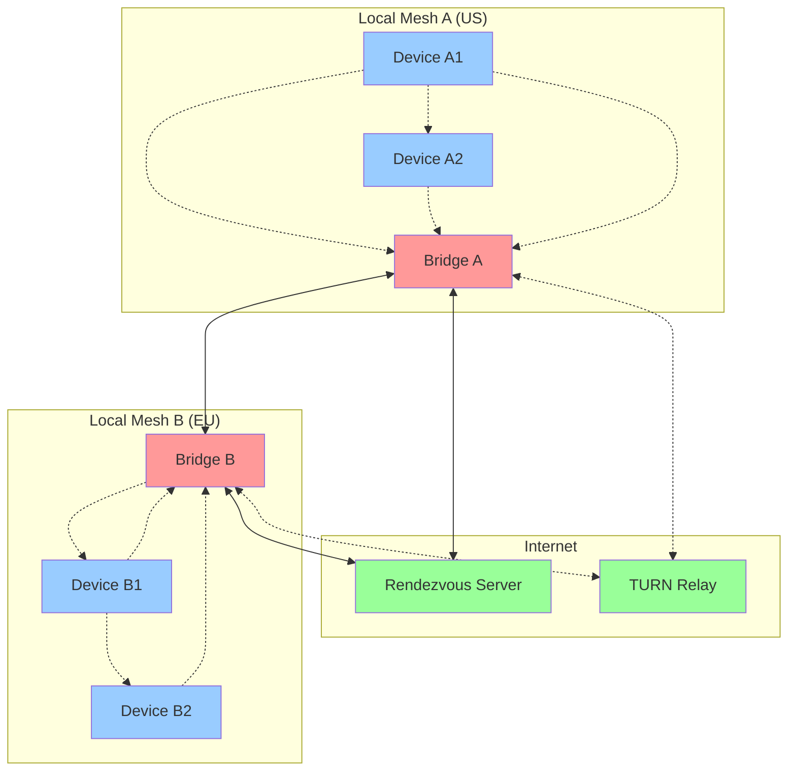

# Global Mode - Worldwide Mesh Connectivity

## Overview

Global Mode enables end-to-end encrypted communication between distant mesh networks (e.g., US ↔ EU) while maintaining the same security guarantees as local mesh connections. The system uses bridge nodes to relay ciphertext between mesh networks, with QUIC/UDP as the primary transport and WebRTC as fallback.

## Architecture



## Core Components

### 1. Bridge Service (`BridgeService.ts`)
- **Role**: Relays E2E ciphertext between mesh networks
- **Security**: Validates ciphertext entropy, blocks plaintext
- **Limits**: Rate limiting, battery protection, attestation checks
- **Monitoring**: Session tracking, bandwidth monitoring

### 2. Rendezvous Client (`RendezvousClient.ts`)
- **Role**: Minimal signaling for connection establishment
- **Security**: Pinned server keys, ephemeral tokens only
- **Protocol**: WebSocket with TLS, no persistent data storage

### 3. Tunnel Factory (`TunnelFactory.ts`)
- **Primary**: QUIC/UDP for direct connections
- **Fallback**: WebRTC datachannel via TURN relay
- **Timeout**: Direct attempts timeout in 2s, relay in 5s
- **Selection**: Automatic transport selection based on connectivity

### 4. E2E Session (`E2ESession.ts`)
- **Encryption**: Noise XX/XK handshake over tunnel
- **Rekey**: Automatic at 10 min or 32 MiB thresholds
- **Forward Secrecy**: Independent session keys per connection
- **Integrity**: ChaCha20-Poly1305 AEAD with sequence numbers

### 5. Global Mode Coordinator (`GlobalModeCoordinator.ts`)
- **Role**: Main orchestrator for global connectivity
- **State Machine**: Manages connection lifecycle
- **Integration**: Safety manifests, moderation bulletins
- **UI Interface**: Provides status and control APIs

## Security Properties

### End-to-End Encryption
- **Handshake**: Noise XX protocol with X25519 DH
- **Encryption**: ChaCha20-Poly1305 with 256-bit keys
- **Authentication**: Ed25519 signatures for origin verification
- **Forward Secrecy**: Regular key rotation, ephemeral keys

### Bridge Security
- **Ciphertext Only**: Bridges cannot decrypt any content
- **Entropy Validation**: Automatic rejection of plaintext
- **Attestation**: Hardware-backed device verification required
- **Rate Limiting**: Token bucket per peer + global limits

### Trust Model
- **Out-of-Band**: Initial fingerprint exchange via secure channel
- **TOFU**: Trust-on-first-use with verification warnings
- **Revocation**: Origin revocation via moderation bulletins
- **Isolation**: Sessions are cryptographically isolated

## Performance Requirements

### Connection Establishment
- **Direct**: P50 ≤ 3s, P95 ≤ 5s
- **Relay**: P50 ≤ 5s, P95 ≤ 8s
- **Handshake**: Complete in ≤ 2 RTTs

### Latency & Throughput
- **Audio**: One-way ≤ 150ms direct, ≤ 250ms relay
- **Video**: First frame ≤ 1.5s
- **Files**: ≥ 2 MB/s direct, ≥ 512 KB/s relay

### Resource Limits
- **Battery**: Bridge mode ≤ 12%/hour additional drain
- **CPU**: DoS protection keeps usage ≤ 50%
- **Memory**: ≤ 100 MB for 4 concurrent bridge sessions

## Configuration

### global_mode.yml
```yaml
global_mode:
  enabled: true
  rendezvous:
    pinned_key: "<base64>"
    endpoint: "wss://rendezvous.meshtv.network:443/signal"
    log_retention_hours: 24
  ice:
    direct_timeout_s: 2
    stun_servers: ["stun1.l.google.com:19302"]
    relay_fallback_timeout_s: 3
  tunnel:
    transport: "quic"
    keepalive_s: 15
    rekey:
      minutes: 10
      bytes: 33554432
  bridge:
    attestation_required: true
    max_concurrent_sessions: 4
    battery_threshold_percent: 20
```

## User Flows

### 1. Connect to Global Peer
1. User enters peer's fingerprint in Global Mode panel
2. App generates ephemeral token, publishes offer to rendezvous
3. Remote peer fetches offer, establishes tunnel (QUIC → WebRTC fallback)
4. Noise handshake establishes E2E session
5. Media/files flow through encrypted tunnel

### 2. Enable Bridge Mode
1. User toggles Bridge Mode (requires attestation + battery check)
2. Device advertises bridge capability to local mesh
3. Handles connection requests from local peers
4. Relays ciphertext between local mesh and global tunnels
5. Monitors resource usage, disables if limits exceeded

### 3. Moderation Across Networks
1. Moderator issues bulletin (hash block or origin revoke)
2. Bulletin propagates through local mesh
3. Bridge nodes relay bulletin across global tunnels
4. Remote meshes enforce same moderation decisions
5. Content blocked consistently worldwide

## Testing

### Security Tests
- **Ciphertext Validation**: Verify bridges reject plaintext
- **Rekey Seamless**: No data loss during key rotation
- **OOB Trust**: Fingerprint mismatch blocks connection
- **DoS Protection**: Rate limits and resource bounds enforced

### Performance Tests
- **Connection Speed**: Measure establishment times
- **Fallback Latency**: Direct → relay transition speed  
- **Throughput**: File transfer speeds across tunnels
- **Battery Impact**: Bridge mode power consumption

### Integration Tests
- **NAT Traversal**: Symmetric NAT scenarios
- **Moderation Parity**: Bulletin propagation across tunnels
- **Store-and-Forward**: Offline message queueing
- **Multi-hop**: Bridge chains for distant connections

## Deployment

### Development Setup
```bash
# Install dependencies
npm install

# Start development rendezvous server
npm run dev:rendezvous

# Run test suite
npm run test:global-mode

# Generate packet capture for analysis
npm run test:pcap-validation
```

### Production Deployment
1. Deploy rendezvous server with TLS certificate
2. Configure STUN/TURN servers for NAT traversal
3. Distribute pinned server keys via signed configuration
4. Monitor bridge node health and performance
5. Implement bulletin distribution for moderation

### Mobile Integration
```typescript
// Enable Global Mode with Capacitor
import { GlobalModeCoordinator } from '@/services/globalmode/GlobalModeCoordinator';

const coordinator = new GlobalModeCoordinator();
await coordinator.initialize(globalModeConfig);

// Bridge mode requires background processing
import { BackgroundMode } from '@capacitor/background-mode';
await BackgroundMode.enable();
```

## Threat Model

### Assumptions
- **Rendezvous Server**: Honest-but-curious (cannot decrypt)
- **Bridge Nodes**: May be compromised (only see ciphertext)
- **Network**: Hostile (MITM, traffic analysis possible)
- **Devices**: Trusted endpoints with hardware security

### Mitigations
- **Traffic Analysis**: Constant-rate dummy traffic during quiet periods
- **Timing Attacks**: Batched packet transmission with jitter
- **Bridge Compromise**: Regular bridge rotation, multiple paths
- **Key Compromise**: Forward secrecy via frequent rekeying

### Non-Goals
- **Metadata Protection**: Connection patterns may be observable
- **Traffic Volume**: Data volume analysis possible
- **Availability**: No guarantee against network partitions
- **Anonymity**: Not designed for anonymous communication

## Troubleshooting

### Connection Issues
```bash
# Check STUN server connectivity
curl -v stun:stun1.l.google.com:19302

# Validate rendezvous server
openssl s_client -connect rendezvous.meshtv.network:443

# Test NAT type
npm run test:nat-detection
```

### Performance Issues
```bash
# Measure tunnel latency
npm run benchmark:latency

# Profile bridge resource usage
npm run monitor:bridge-stats

# Analyze packet capture
npm run analyze:pcap <capture-file>
```

### Security Validation
```bash
# Verify ciphertext-only property
npm run validate:ciphertext-only

# Test DoS protection
npm run test:dos-resilience

# Audit cryptographic implementation
npm run audit:crypto
```

## Future Enhancements

### Planned Features
- **Multi-path**: Parallel tunnels for redundancy
- **Adaptive Bitrate**: Dynamic quality adjustment
- **Mesh Routing**: Intelligent bridge selection
- **Privacy**: Onion routing for metadata protection

### Research Areas
- **Quantum Resistance**: Post-quantum cryptography integration
- **Scalability**: Hierarchical bridge networks
- **Efficiency**: Protocol optimization for mobile devices
- **Resilience**: Byzantine fault tolerance for bridges

---

For technical support, see the [Security README](../security/SECURITY_README.md) or file an issue with packet captures and debug logs.